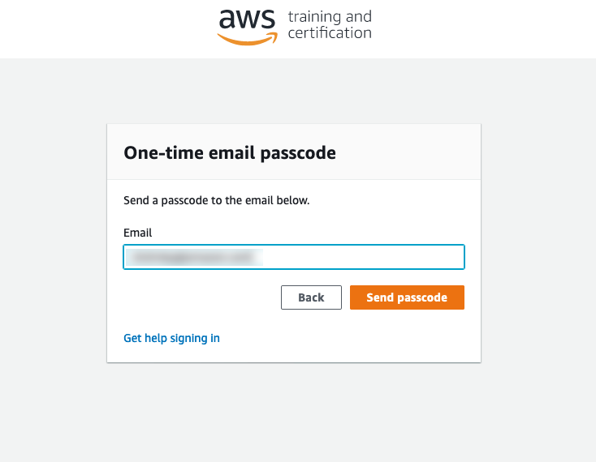
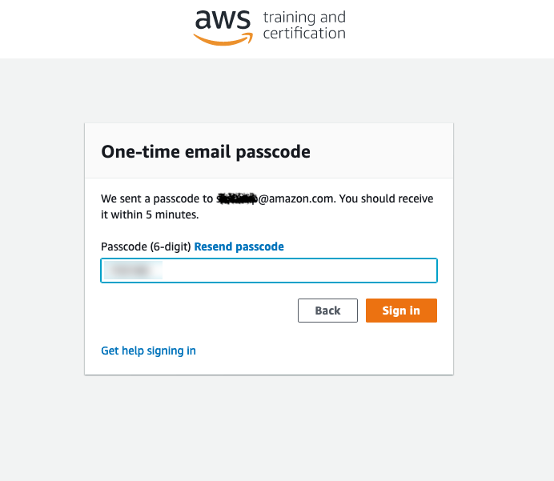
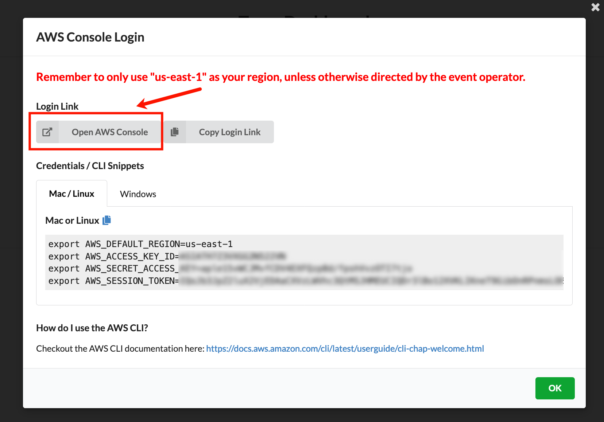
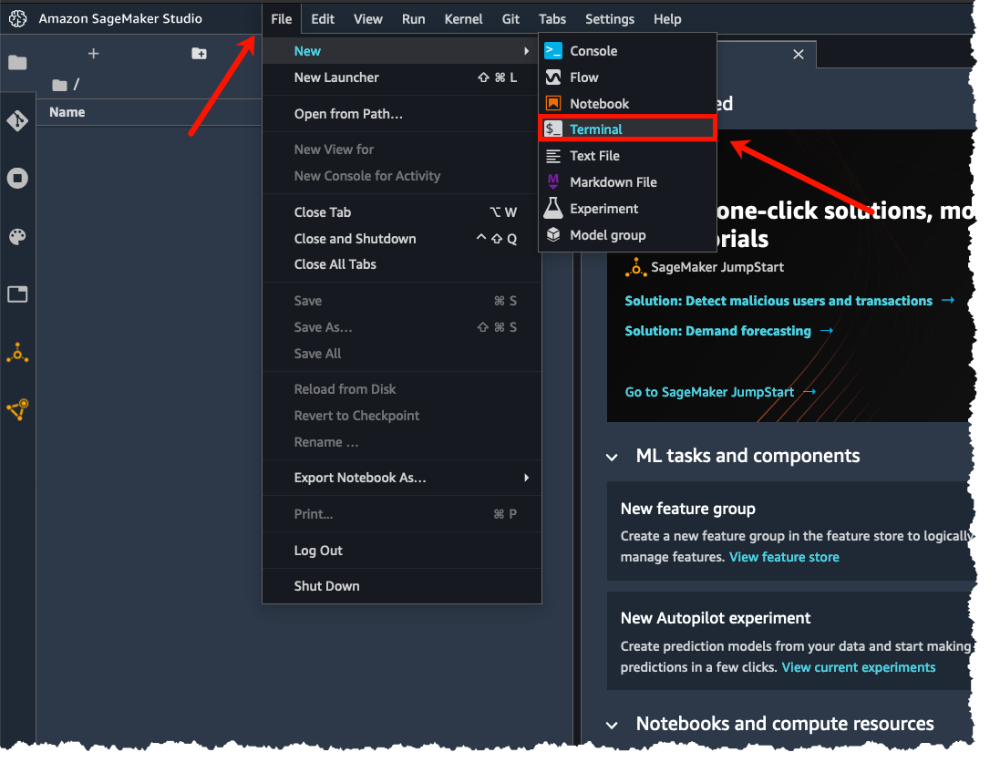

# Hugging Face on Amazon SageMaker Workshop

Earlier this year we announced a strategic collaboration with Amazon to make it easier for companies to use Hugging Face in SageMaker, and ship cutting-edge Machine Learning features faster. We introduced new Hugging Face Deep Learning Containers (DLCs) to train Hugging Face Transformer models in Amazon SageMaker.

In addition to the Hugging Face Inference Deep Learning Containers, we created a new Inference Toolkit for SageMaker. This new Inference Toolkit leverages the pipelines from the transformers library to allow zero-code deployments of models, without requiring any code for pre- or post-processing. In the "Getting Started" section below, you will find two examples of how to deploy your models to Amazon SageMaker.

In addition to zero-code deployment, the Inference Toolkit supports "bring your own code" methods, where you can override the default methods. You can learn more about "bring your own code" in the documentation here, or you can check out the sample notebook "deploy custom inference code to Amazon SageMaker".

In this workshop we are going to cover: 

* Train on Amazon SageMaker
    * Prepare and upload a test dataset to S3
    * Prepare a fine-tuning script to be used with Amazon SageMaker Training jobs
    * Launch a training job and store the trained model into S3
* Deploy a trained model on Amazon SageMaker
    * Load a pre-trained model from S3 and deploy on Amazon SageMaker endpoint for real-time inference 
    * Deploy a pre-trained model from S3 and deploy on Amazon SageMaker endpoint for batch inference
    

# Getting Started

For this workshop you’ll get access to a temporary AWS Account already pre-configured with Amazon SageMaker Studio. Follow the steps in this section to login to your AWS Account and download the workshop material.

### 1. To get started navigate to - https://dashboard.eventengine.run/login 

Click on Accept Terms & Login

### 2. Click on Email One-Time OTP (Allow for up to 2 mins to receive the passcode)

### 3. Provide your email address

### 4. Enter your OTP code

### 5. Click on AWS Console

### 6. Click on Open AWS Console

### 7. In the AWS Console click on Amazon SageMaker

### 8. Click on Amazon SageMaker Studio and then click on Open Studio

### 9. You should now have Amazon SageMaker Studio interface open on your browser

### 10. Open a new terminal window

### 11. Clone the workshop content

In the terminal paste the following command to clone the workshop content repo:

`git clone https://github.com/C24IO/SageMaker-HuggingFace-Workshop.git`

### 12. Rejoin the presenter for a live walkthrough of the workshop

## Troubleshooting

### Selecting the right Kernel

These notebooks have been developed on SageMaker Studio using the following 2 kernels, please use them in case you run into errors:

To change kernel, do this:

#### Sources:

* https://huggingface.co/docs/sagemaker/main
* https://github.com/huggingface/notebooks/tree/master/sagemaker

